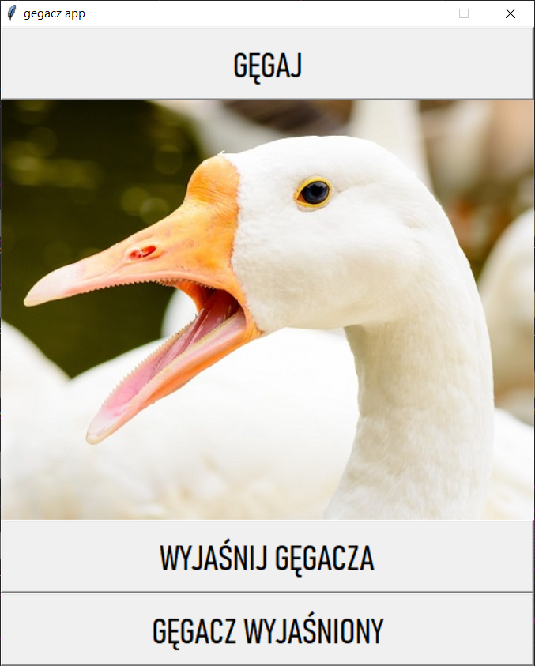

# gegacz_app
nastepny gegacz wyjasniony

## usage

 - download files from dist directory (gegacz_app.7z.001, gegacz_app.7z.002, gegacz_app.7z.003)
 
 - unpack them to gegacz_app.exe
 
 - run `gegacz_app.exe` with double click

## build exe on your own

 - `git clone https://github.com/redorb/gegacz_app`
 
 - `pip install Pillow playsound pyinstaller`
 
 - `pyinstaller -F --add-data "resources/wyjasnianie_gegacza.mp3;resources" --add-data "resources/gegacz_wyjasniony.mp3;resources" --add-data "resources/hymn_gegaczy.mp3;resources" --add-data "resources/goose.jpg;resources" gegacz_app.py`

 - executable should be created in dist directory
 
## screenshot

